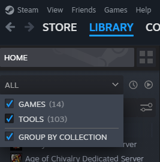
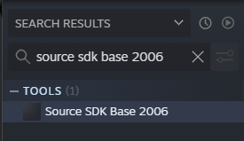

# Downloading
Garry's Mod 9 is available for free on these sources (well, actually it's free on everywhere, i just listed those sources that you could trust, because you can get a virus from other sources):

- [ModDB](https://www.moddb.com/mods/garrys-mod/downloads/gmod-904)
- [gmod9.com (fixed)](https://gmod9.com/download)
  
In order to install Garry's Mod 9, you'll need to have **Source SDK Base 2006**, not a newer version because it wouldn't work. It is available on Steam, but in the library, and in order to find it, make sure to filter by all:

Then click on the search bar and search for "*Source SDK Base 2006*", then click on Install:

After you have installed it, do the following:
### ModDB
Click the "Download Now" button, open the installer, and follow the instructions to install the mod. Just install it into your "*sourcemods*" folder in the steam/steamapps thing.
### gmod9.com
Just drag the folder from the archive to your "*sourcemods*" folder in the steam/steamapps thing.

After you have done the procedure, you also need to put in the launch options of **Source SDK Base 2006** the following:
`-game "(path to gmod 9 here) -novid"`, where the *(path to gmod 9 here)* is the directory you are storing your Garry's Mod 9 in. And when you have done that, just run the game and BOOM! It works!
